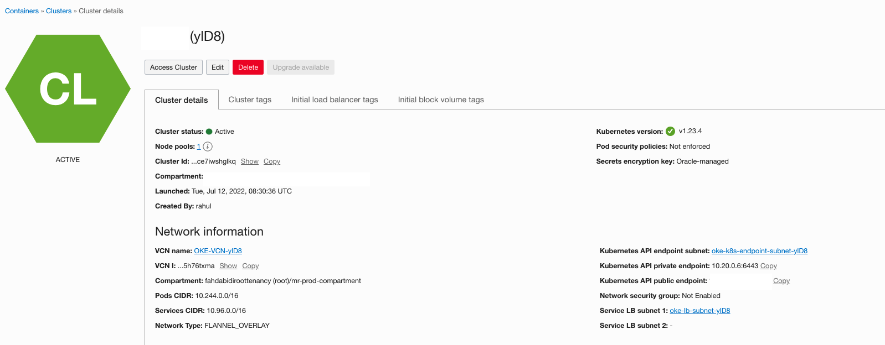
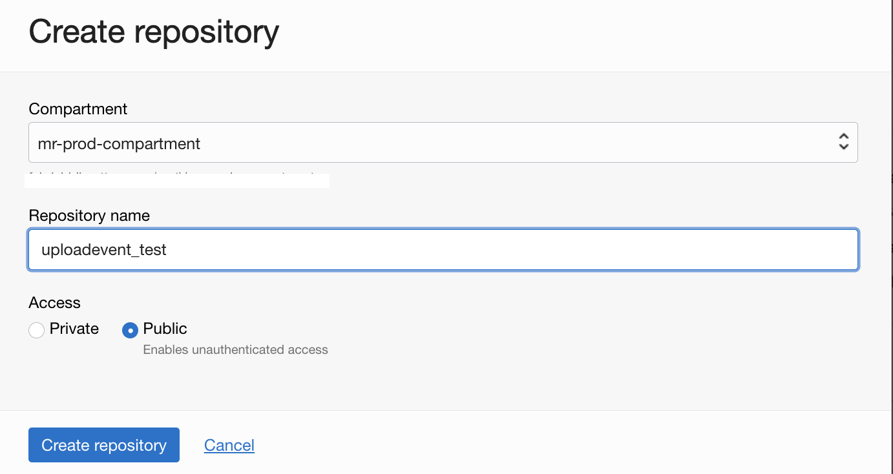
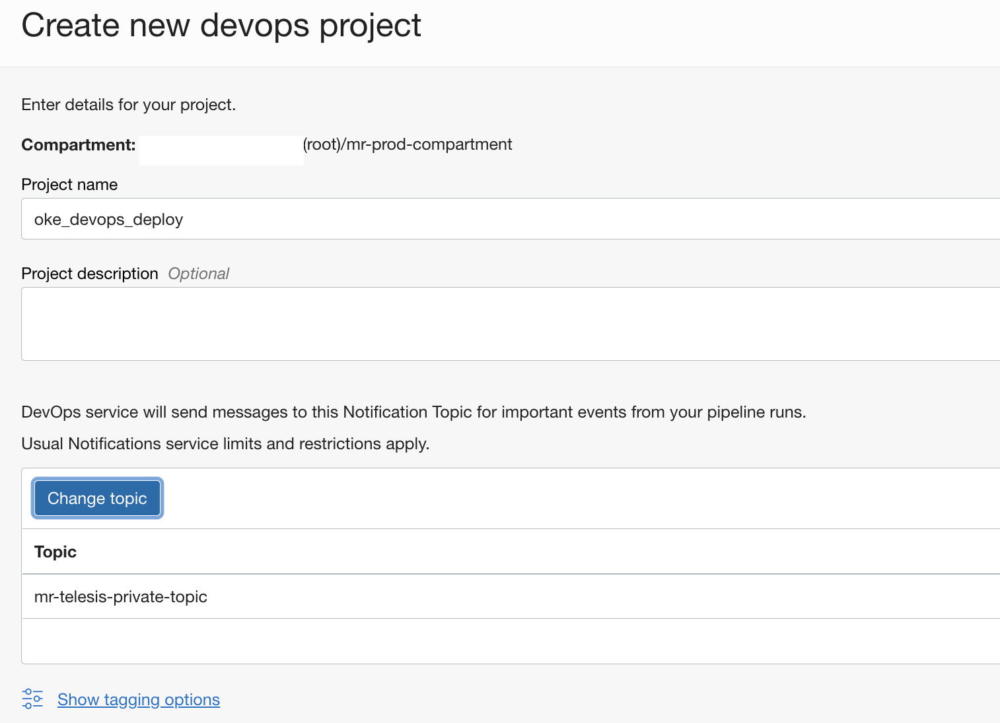
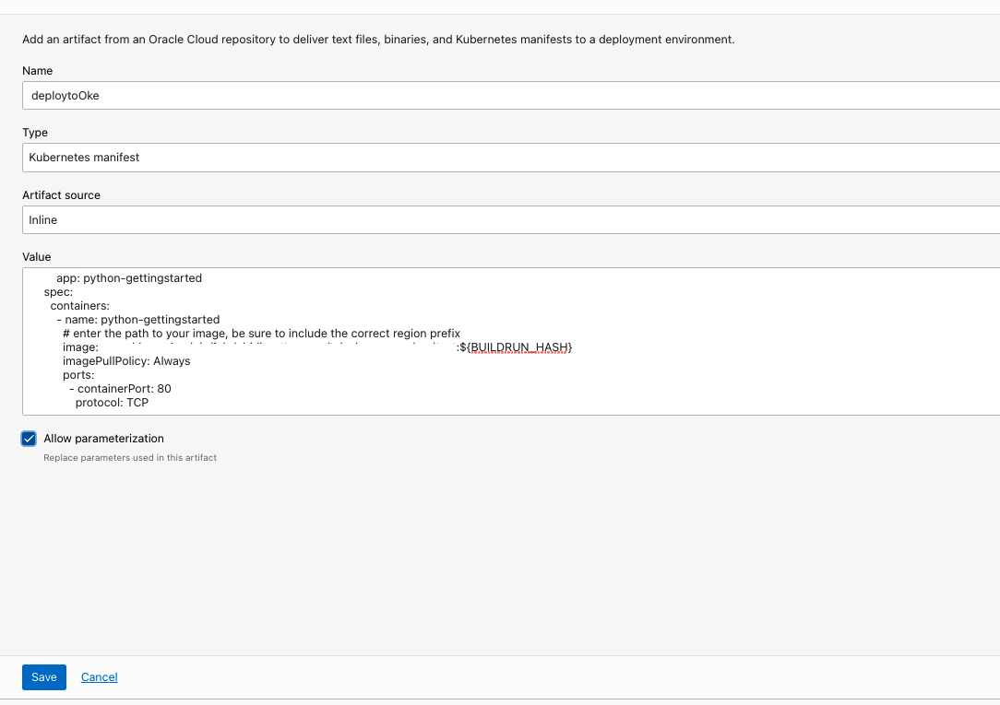
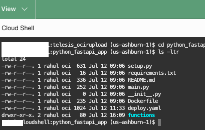
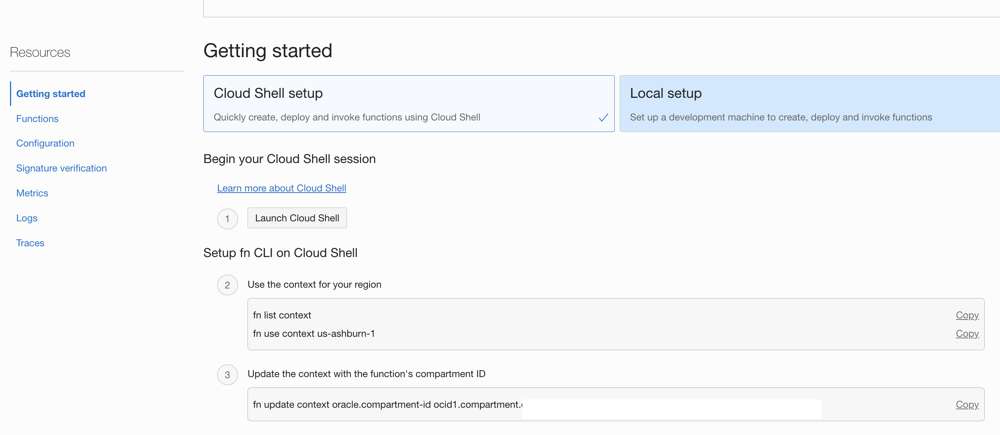
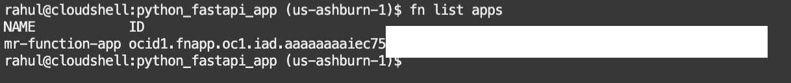

# Invoke OCI Devops deployment pipline on a container image upload.


## Objective

- Invoke a deployment pipeline when a user uploads a new container image.
- We will be using OCI Service Connector hub to connect between the image upload and deployment pipeline invoke.

### Category : Intermediate or expert on OCI services.

## OCI Devops 

- The Oracle Cloud Infrastructure (OCI) DevOps service is an end-to-end, continuous integration and continuous delivery (CI/CD) platform for developers.

- Use this service to easily build, test, and deploy software and applications on Oracle Cloud. The DevOps build and deployment pipelines reduce change-driven errors and decreases the time customers spend on building and deploying releases. The service also provides private Git repositories to store your code and supports connections to external code repositories.

- Read more [here](https://docs.oracle.com/en-us/iaas/Content/devops/using/devops_overview.htm)

## OCI Service connector hub 

- Service Connector Hub is a cloud message bus platform that offers a single pane of glass for describing, executing, and monitoring movement of data between services in Oracle Cloud Infrastructure.
- Data is moved using service connectors. A service connector specifies the source service that contains the data to be moved, optional tasks, and the target service for delivery of data when tasks are complete. An optional task might be a function task to process data from the source or a log filter task to filter log data from the source.
- Read more [here](https://docs.oracle.com/en-us/iaas/Content/service-connector-hub/overview.htm) 

## OCI Functions

- Oracle Functions is a fully managed, multi-tenant, highly scalable, on-demand, Functions-as-a-Service platform. It is built on enterprise-grade Oracle Cloud Infrastructure and powered by the Fn Project open source engine. Use Oracle Functions (sometimes abbreviated to just Functions) when you want to focus on writing code to meet business needs.

- Read more [here](https://docs.oracle.com/en-us/iaas/Content/Functions/Concepts/functionsoverview.htm)


## Procedure to use this illustration.

- Create an OCI notification topic - https://docs.oracle.com/en-us/iaas/Content/Notification/Tasks/managingtopicsandsubscriptions.htm#createTopic

- Create an OCI Dynamic group and add the below rules. Replace <YOUR_COMPARMENT_OCID> with your compartment OCID. - https://docs.cloud.oracle.com/iaas/Content/Identity/Tasks/managingdynamicgroups.htm

```markdown
ALL {resource.type = 'devopsdeploypipeline', resource.compartment.id = '<YOUR_COMPARMENT_OCID>'}
ALL {resource.type = 'fnfunc', resource.compartment.id = '<YOUR_COMPARMENT_OCID>'}
```
- Create an OCI policy and add the following policy statements. Replace <YOUR_DynamicGroup_NAME> with the name of your dynamic group, and <YOUR_COMPARTMENT_NAME> with the name of your compartment. - https://docs.cloud.oracle.com/iaas/Content/Identity/Concepts/policies.htm

```markdown
Allow dynamic-group <YOUR_DynamicGroup_NAME>  to manage devops-family in compartment <YOUR_COMPARTMENT_NAME>
Allow dynamic-group <YOUR_DynamicGroup_NAME>  to manage generic-artifacts in compartment <YOUR_COMPARTMENT_NAME>	Allow dynamic-group <YOUR_DynamicGroup_NAME>  to manage generic-artifacts in compartment <YOUR_COMPARTMENT_NAME>
Allow dynamic-group <YOUR_DynamicGroup_NAME>  to use ons-topics in compartment <YOUR_COMPARTMENT_NAME>
Allow group <YOUR_DynamicGroup_NAME>  to manage cluster-family in compartment <YOUR_COMPARTMENT_NAME>
```
- Create an OKE with public nodes and public api server -  https://docs.oracle.com/en-us/iaas/Content/ContEng/home.htm



- Create a public OCI Container registry repo - https://docs.oracle.com/en-us/iaas/Content/Registry/Tasks/registrycreatingarepository.htm#Creating_a_Repository



- Create a DevOps project - https://docs.oracle.com/en-us/iaas/Content/devops/using/create_project.htm#create_a_project. Associate with the notification topic.



- Enable logging for the DevOps project.


- Create a devops artifact - https://docs.oracle.com/en-us/iaas/Content/devops/using/artifacts.htm
- Use type as `Kubernetes manifest` and source as `Inline`.
- Use the content of file [deploy.yaml](deploy.yaml) ,with correct reference to the container image path. 

- Enable parameterization.

```markdown
image: <OCI Region>.ocir.io/<Namespace>/<Name of the Repo>:${BUILDRUN_HASH}
```


- Create a devops `Kubernetes Cluster Environment` - https://docs.oracle.com/en-us/iaas/Content/devops/using/create_oke_environment.htm 


- Create a new devops `deployment pipeline` - https://docs.oracle.com/en-us/iaas/Content/devops/using/deployment_pipelines.htm
- Add below as `Deployment paramters`

```markdown
Name : BUILDRUN_HASH / Default value : 0.0 
Name : namespace / Default value : ns-deploy
```


- Under the pipeline add a stage ,type as `Apply manifest to your Kubernetes cluster`


- Select the `Environment` and `Artifact` created and save the stage.


- Use `OCI Cloud shell` and clone the repo .



- Create an OCI Function application - https://docs.oracle.com/en-us/iaas/Content/Functions/Tasks/functionscreatingapps.htm#Creating_Applications
- You may use the same VCN that was created as part of OKE.


- Follow `Getting started` under the Application and set up the Cloud shell (Follow until step 7) .



- Validate the `Application` via cloud shell .

```markdown
fn list apps
```


- Deploy the application 
```markdown
$ cd oci-devops-deploy-on-imageupload/functions
$ fn deploy --app <Name of Your FN Application> -v
```


